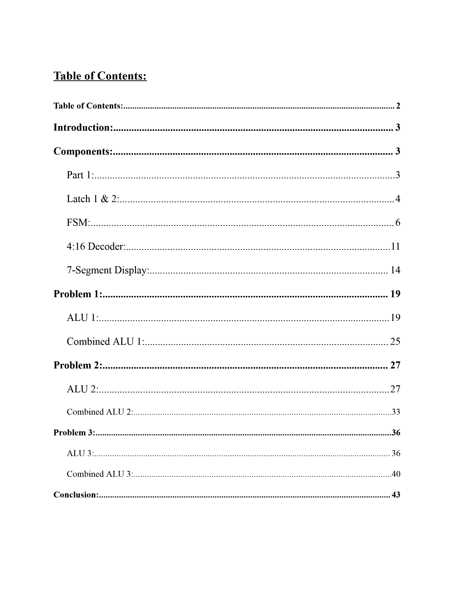

# COE328 — Laboratory 6: Design of a Simple Central Processing Unit

This repository contains the design and implementation for **Lab 6 of COE328 (Digital Systems)** at Toronto Metropolitan University (TMU).  
The objective of this lab was to design and implement **three different general-purpose low-level CPUs**, each with distinct functionality, using VHDL and previously developed digital components.

---

## Overview

The CPUs are built from modular components:
- **Two 8-bit Latches (Registers)** — Store input operands `A` and `B`.
- **Finite State Machine (FSM)** — Cycles through 8 states (Moore logic) driven by the student ID digits.
- **4:16 Decoder** — Converts FSM outputs into control signals (opcodes).
- **Arithmetic Logic Units (ALUs)** — Three distinct ALUs implementing different sets of operations.
- **7-Segment Display Driver(s)** — Show results of ALU operations or decision outputs (`y/n`) on hardware.

Inputs are derived from the student number (`501263004`):  
- `A = 30 (00011110₂)`  
- `B = 04 (00000100₂)`  

---

## Components

### Latches (Registers)
- Two 8-bit D flip-flops used to hold inputs `A` and `B`.
- Triggered on the rising edge of the clock.
- Reset sets the outputs to `00000000`.

### Finite State Machine (FSM)
- Cycles through states **S0 → S7**, looping back to S0.
- Outputs both the current state and a **student ID digit** (from the ID).
- Supplies a 4-bit signal to the decoder.

### 4:16 Decoder
- Converts the FSM’s 4-bit state into a **16-bit one-hot opcode**.
- Built hierarchically using five 2:4 decoders.
- Provides the control inputs to the ALUs.

### 7-Segment Display
- **Iteration 1**: Displays hexadecimal values and supports negative sign output.  
- **Iteration 2**: Specialized version to display `'y'` or `'n'` for ALU3 outputs.

---

## ALU Designs

### **ALU 1**
Implements 8 fundamental operations:
1. A + B (sum)  
2. A – B (difference)  
3. NOT(A)  
4. NAND(A, B)  
5. NOR(A, B)  
6. AND(A, B)  
7. XOR(A, B)  
8. OR(A, B)  

Outputs split into **two 4-bit halves (R1, R2)** for display on dual 7-segments, plus a negative flag.

---

### **ALU 2**
Implements a new set of 8 operations:
1. Increment A by 2  
2. Shift B right by 2 (fill with 0)  
3. Shift A right by 4 (fill with 1s)  
4. Min(A, B)  
5. Rotate A right by 2  
6. Reverse bit order of B  
7. XOR(A, B)  
8. (A + B) – 4  

Same I/O structure as ALU 1.

---

### **ALU 3**
Implements a decision-based operation set:  
- For each opcode, check if **either digit of B < student_id digit**.  
- Displays `'y'` if true, `'n'` otherwise.  
- Uses the custom `'y/n'` 7-segment display driver.

---

## Verification & Results
- All designs verified through:
  - **VHDL simulation waveforms**
  - **Truth tables**
  - **Hand calculations**
  - **FPGA board testing**
- Outputs matched expected results across all three ALUs.

---

## Key Learnings
- Importance of **modular design**: Latches, FSM, decoder, ALUs, and displays reused across CPUs.
- **Control path vs datapath** separation: FSM + decoder control ALU operations.
- Reinforced VHDL coding, simulation, and debugging.
- Highlighted verification discipline through truth tables, simulation, and hardware validation.

---

## Full Report

For a complete write-up of the design, implementation details, VHDL code listings, simulation results, and verification, see the full lab report:

➡️ Click the image above to view the full PDF.

---

## Notes
- This repo is for **showcasing and educational purposes only**.  
- Do not copy/paste code for submissions — it violates TMU’s academic integrity policies (Policy 60).  
- Use this as a **reference for understanding digital systems design**.

---
